# DML та DDL команди. Складні SQL вирази

**1. Створіть базу даних для керування бібліотекою книг згідно зі структурою, наведеною нижче. Використовуйте DDL-команди для створення необхідних таблиць та їх зв'язків.**

### Структура БД

a) Назва схеми — `“LibraryManagement”`

b) Таблиця `"authors":`
`author_id` (`INT`, автоматично зростаючий `PRIMARY KEY`)
`author_name` (`VARCHAR`)

c) Таблиця `"genres"`:

- `genre_id` (`INT`, автоматично зростаючий `PRIMARY KEY`)
- `genre_name` (`VARCHAR`)

d) Таблиця `"books"`:

- `book_id` (`INT`, автоматично зростаючий `PRIMARY KEY`)
- `title` (`VARCHAR`)
- `publication_year` (`YEAR`)
- `author_id` (`INT`, `FOREIGN KEY` зв'язок з `"Authors"`)
- `genre_id` (`INT`, `FOREIGN KEY` зв'язок з `"Genres"`)

e) Таблиця `"users"`:

- `user_id` (`INT`, автоматично зростаючий `PRIMARY KEY`)
- `username` (`VARCHAR`)
- `email` (`VARCHAR`)

f) Таблиця `"borrowed_books"`:

- `borrow_id` (`INT`, автоматично зростаючий `PRIMARY KEY`)
- `book_id` (`INT`, `FOREIGN KEY` зв'язок з `"Books"`)
- `user_id` (`INT`, `FOREIGN KEY` зв'язок з `"Users"`)
- `borrow_date` (`DATE`)
- `return_date` (`DATE`)

#### Скрипт завдання 1 ([script1.sql](./script1.sql))

#### Workbanch

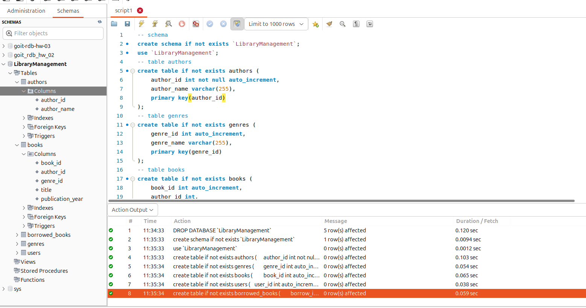

#### Console

**2. Заповніть таблиці простими видуманими тестовими даними. Достатньо одного-двох рядків у кожну таблицю.**

#### Скрипт завдання 2 ([script2.sql](./script2.sql))

#### Workbanch

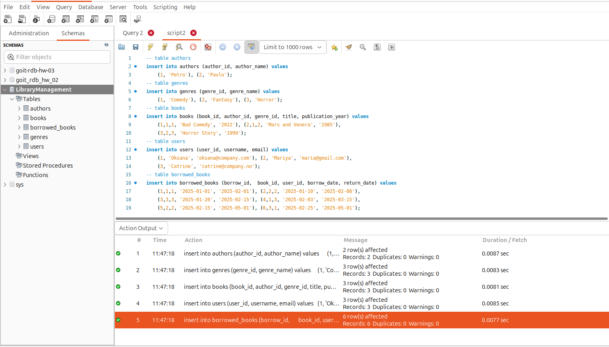

#### Console

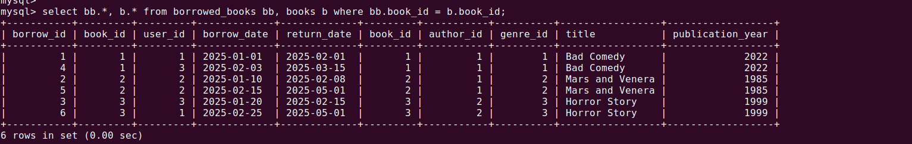

**3. Перейдіть до бази даних, з якою працювали у темі 3. Напишіть запит за допомогою операторів `FROM` та `INNER JOIN`, що об’єднує всі таблиці даних, які ми завантажили з файлів: `order_details`, `orders`, `customers`, `products`, `categories`,`employees`, `shippers`, `suppliers`. Для цього ви маєте знайти спільні ключі. Перевірте правильність виконання запиту.**

#### Скрипт завдання 3 ([script3.sql](./script3.sql))

#### Workbanch

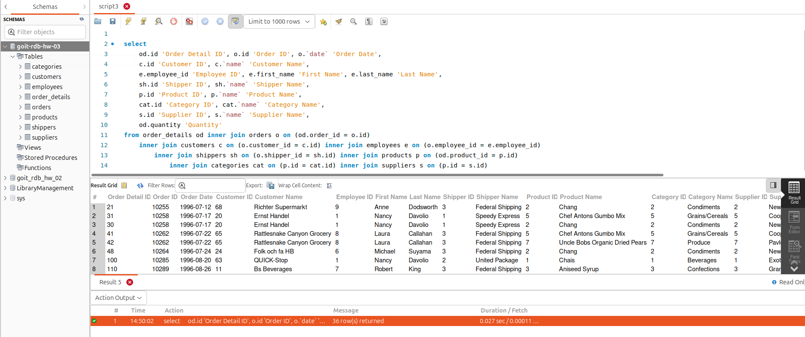

**4. Виконайте запити, перелічені нижче.**

- Визначте, скільки рядків ви отримали (за допомогою оператора `COUNT`).

#### Скрипт завдання 4-1 ([script4-1.sql](./script4-1.sql))

#### Workbanch

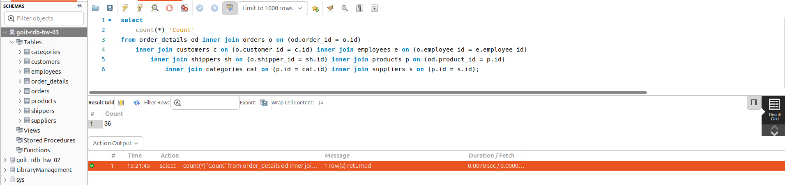

- Змініть декілька операторів `INNER` на `LEFT` чи `RIGHT`. Визначте, що відбувається з кількістю рядків. Чому? Напишіть відповідь у текстовому файлі.

#### Скрипт завдання 4-2 ([script4-2.sql](./script4-2.sql))

#### Workbanch

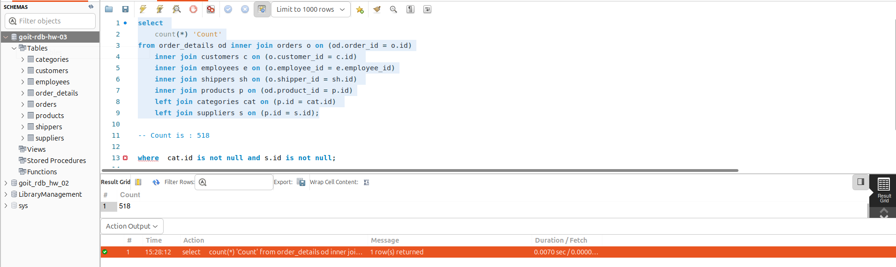

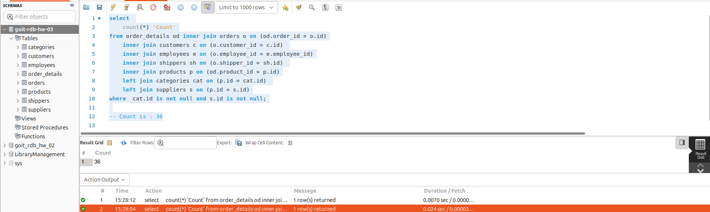

- На основі запита з пункта 3 виконайте наступне: оберіть тільки ті рядки, де `employee_id > 3` та `≤ 10`.

#### Скрипт завдання 4-3 ([script4-3.sql](./script4-3.sql))

#### Workbanch

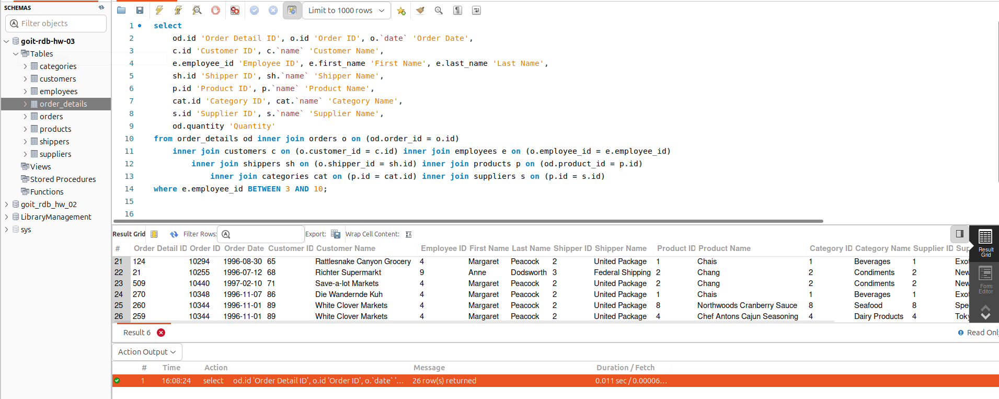

- Згрупуйте за іменем категорії, порахуйте кількість рядків у групі, середню кількість товару (кількість товару знаходиться в `order_details.quantity`)

#### Скрипт завдання 4-4 ([script4-4.sql](./script4-4.sql))

#### Workbanch

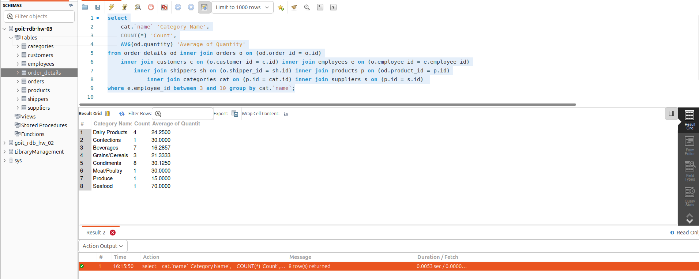

- Відфільтруйте рядки, де середня кількість товару більша за 21.

#### Скрипт завдання 4-5 ([script4-5.sql](./script4-5.sql))

#### Workbanch

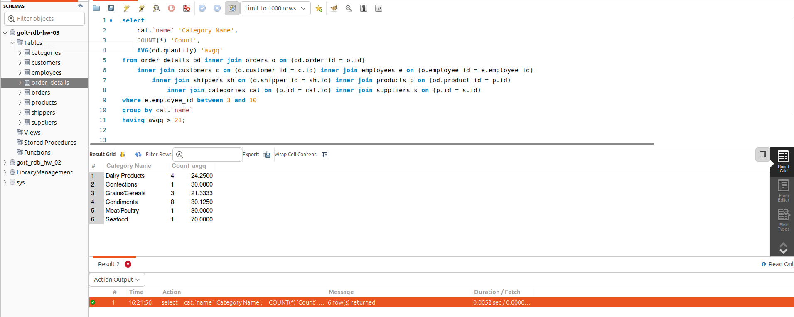

- Відсортуйте рядки за спаданням кількості рядків.

#### Скрипт завдання 4-6 ([script4-6.sql](./script4-6.sql))

#### Workbanch

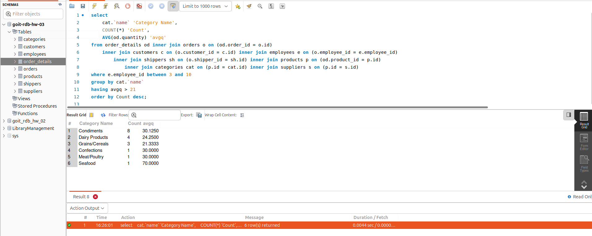

- Виведіть на екран (оберіть) чотири рядки з пропущеним першим рядком.

#### Скрипт завдання 4-7 ([script4-7.sql](./script4-7.sql))

#### Workbanch

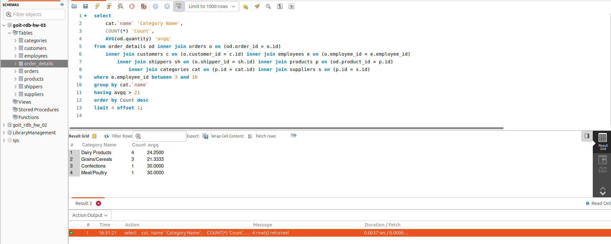
